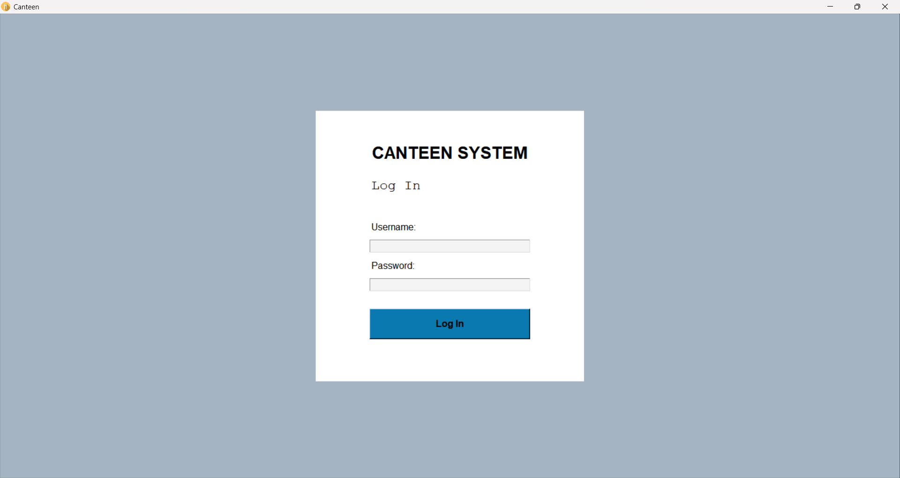
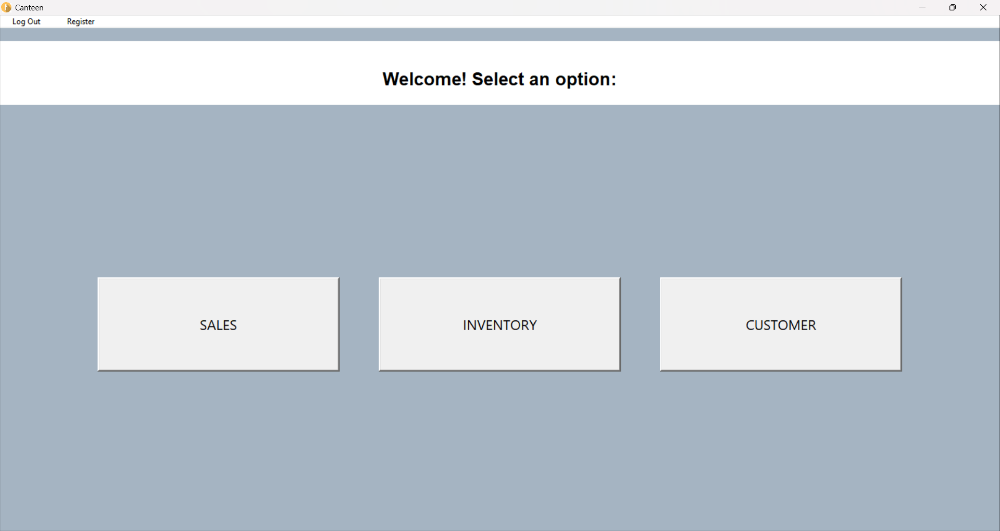

# Canteen Inventory & Sales Management System

A desktop application built with **Python** and **Tkinter** for managing the inventory, sales, and customer relationships of a university (small) canteen. Developed as the final project for the Object-Oriented Programming course at Universidad Politécnica Taiwán-Paraguay (2024).

---

## Screenshots

| Login | Main Menu |
|---|---|
|  |  |

---

## Features

- **Authentication** — Multi-user login and registration system
- **Sales Management** — Record, edit, and export sales with automatic receipt numbering
- **Inventory Control** — Add, update, and delete products with real-time stock tracking
- **Customer Management** — Register customers and view their full purchase history
- **Excel Export** — Export sales (by date or all-time) and inventory to `.xlsx` files
- **SQLite Database** — All data stored locally in a single `canteen.db` file

---

## Tech Stack

| Technology | Purpose |
|---|---|
| Python 3.11+ | Core language |
| Tkinter | GUI |
| SQLite3 | Local database (built-in) |
| tkcalendar | Date picker widget |
| openpyxl | Excel file generation |

---

## 📂 Project Structure

```
canteen-management-system/
├── src/
│   ├── main.py               # Entry point
│   ├── database.py           # All SQLite queries (data access layer)
│   ├── user_interface.py     # Base class — root window, menu, registration
│   ├── login_frame.py        # Login screen
│   ├── options_frame.py      # Main menu (Sales / Inventory / Customer)
│   ├── sales_frame.py        # Sales management
│   ├── inventory_frame.py    # Inventory management
│   ├── customer_frame.py     # Customer management
│   └── user.py               # User and Customer model classes
├── assets/
│   ├── comedor.ico
│   ├── add_product.ico
│   ├── edit_product.ico
│   ├── new_register.ico
│   ├── sales.ico
│   └── show_customer.ico
├── database/
│   └── canteen.db            # Auto-generated on first run
├── .gitignore
├── requirements.txt
└── README.md
```

---

## Guide to run the project

### Prerequisites

- Python 3.11 or higher
- pip

### Installation

```bash
# 1. Clone the repository
git clone https://github.com/your-username/canteen-management-system.git
cd canteen-management-system

# 2. (Recommended) Create a virtual environment based on your OS  

# 3. Install dependencies
pip install -r requirements.txt

# 4. Run the application
cd src  #make sure you are in the src folder 
python main.py
```

The database (`database/canteen.db`) is created automatically on the first run.

### Default first run

No users exist yet — use **Register** from the menu bar after logging in with any credentials, or add a default user directly:

```python
# Quick setup script (run once)
import sys; sys.path.insert(0, 'src')
import database as db
db.init_db()
db.save_user("Admin", "admin", "admin123")
print("User created: admin / admin123")
```

---

## 🏗️ OOP Design

The project follows Object-Oriented Programming principles throughout:

| Principle | Implementation |
|---|---|
| **Encapsulation** | Each frame class manages its own widgets and data |
| **Inheritance** | All frame classes inherit from `tk.Frame`; `UserInterface` acts as the base controller |
| **Abstraction** | `database.py` exposes a clean API — frames never touch raw SQL |
| **Modularity** | Each screen lives in its own file, making the code easy to extend |

---

## 📄 License

This project was developed for academic purposes at Universidad Politécnica Taiwán-Paraguay.
